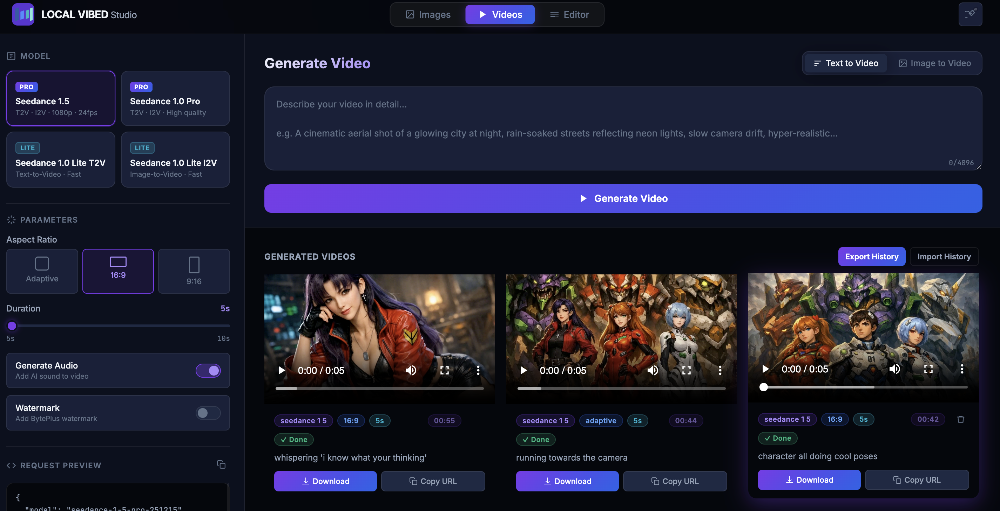
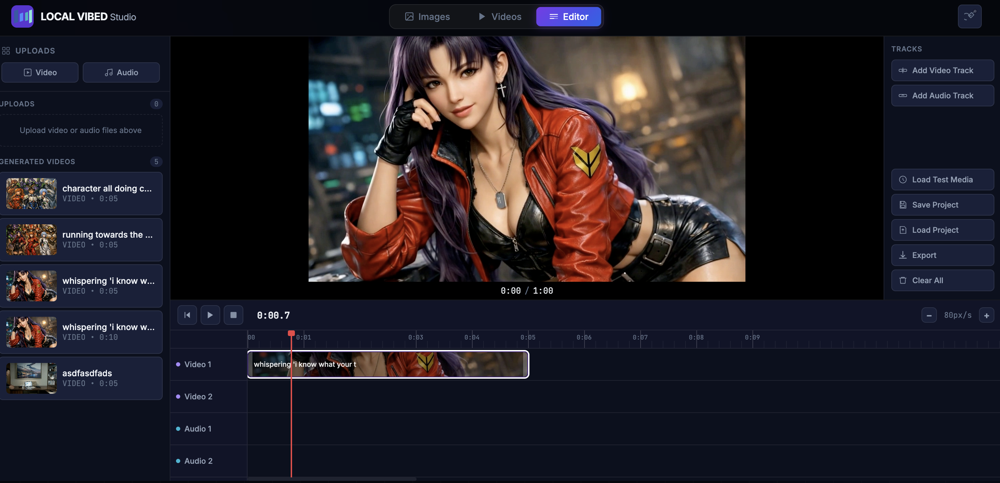

# Vibed Studio

 Vibed Studio is a lightweight, local-first UI for generating and managing AI videos and images with BytePlus. It runs entirely in the browser and stores history locally (IndexedDB), with an optional dev server for CORS-safe image generation and editor access.

## Live Demo
Once GitHub Pages is enabled for this repo, you can launch the app here:
https://drgoldenpants.github.io/VibedStudio/

## Features
- Video generation (text or image prompt)
- Image generation (Seedream models)
- Local history for videos and images
- JSON request/response previews
- Optional dev server with CORS proxy for image generation

## Quick Start
### 1) Open in the browser
You can open the app directly:
- Double-click `index.html`

This works for video generation, but Images and Editor tabs require server mode.

### 2) Server mode (recommended)
Run the included dev server to enable Images and Editor tabs and avoid CORS issues:
```bash
python3 server.py
```
Then open:
```
http://localhost:8787
```

### 3) Set your API key
Click the key icon in the header and paste your BytePlus API key. The key is stored in `localStorage` on your machine.

## Screenshots



## Desktop App (One‑Click Installers)
You can ship VibedStudio as a native app for macOS, Windows, and Linux.

### Build locally
```bash
npm install
npm run dist
```

Artifacts will appear in `dist/`:
- macOS: `.dmg`
- Windows: `.exe` (NSIS installer)
- Linux: `.AppImage`

### Create a GitHub Release
Releases are generated automatically by GitHub Actions when you push a version tag:
```bash
git tag v0.1.0
git push origin v0.1.0
```
The workflow builds installers for macOS, Windows, and Linux and publishes them on the GitHub Releases page.

## Project Structure
- `index.html` — main UI shell
- `style.css`, `editor.css`, `images.css` — styling
- `app.js` — video generation UI logic
- `images.js` — image generation UI logic
- `editor.js` — editor tab logic
- `server.py` — minimal CORS-aware dev server with image proxy

## Notes
- The Images and Editor tabs are disabled when opened via `file://` because they require server mode.
- All history is stored locally in your browser (IndexedDB).

## License
TBD
