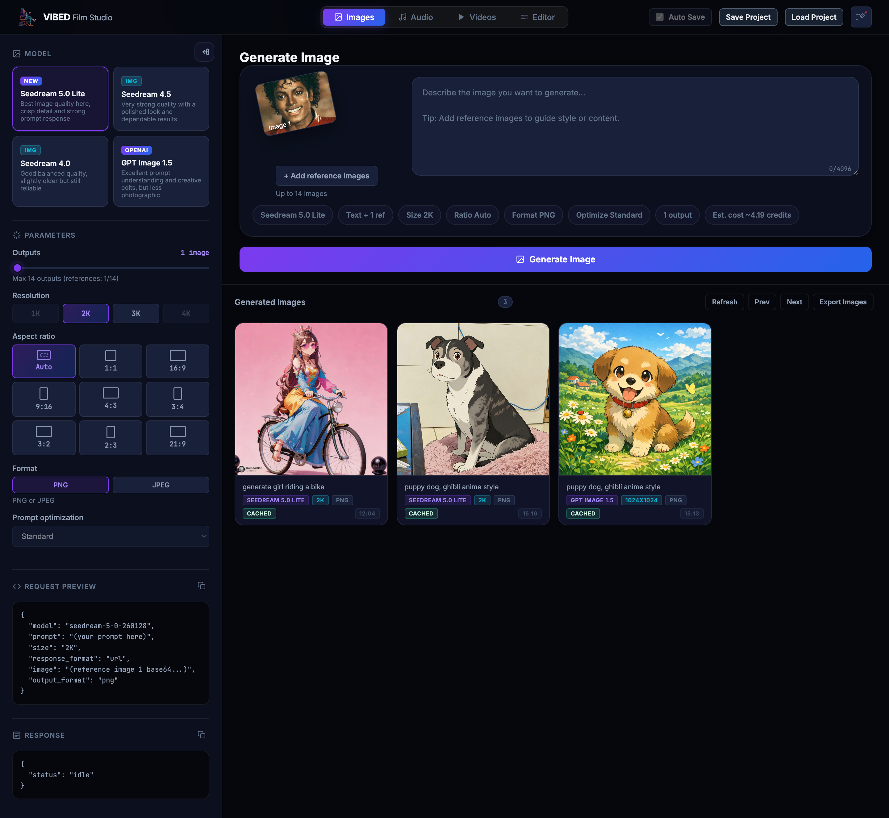
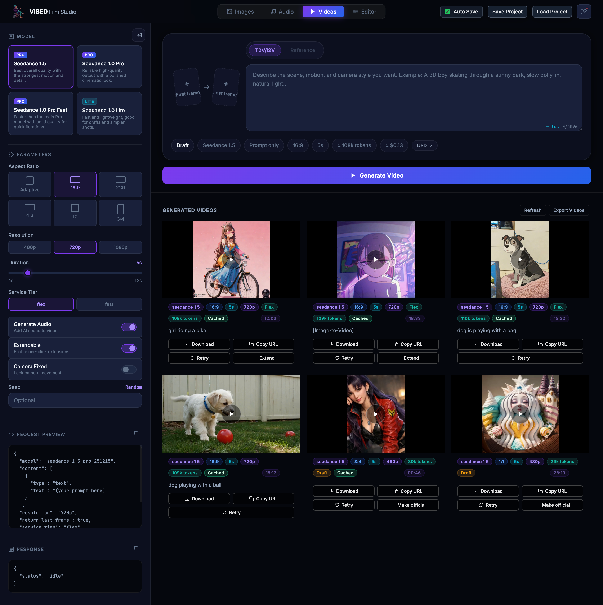
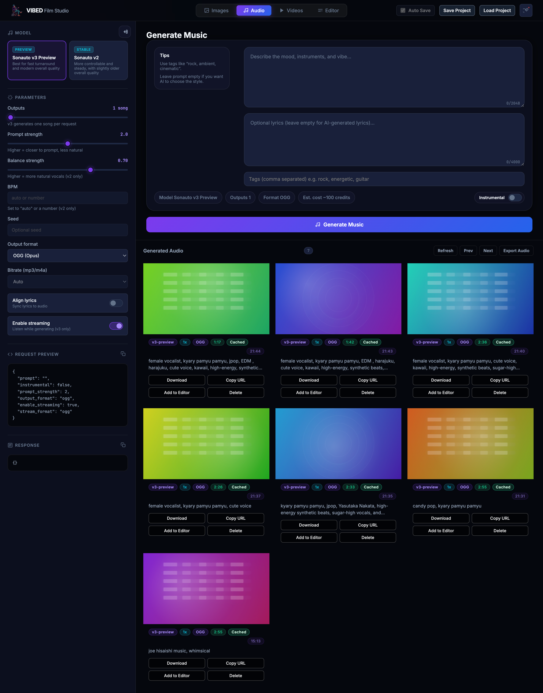
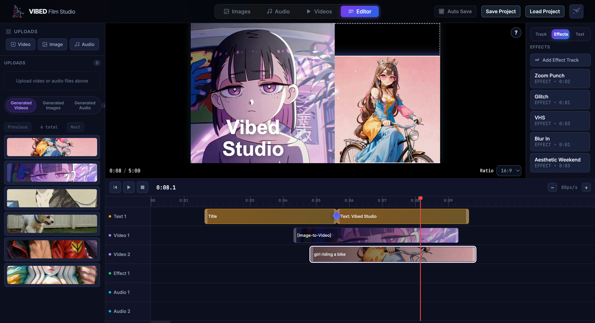

# Vibed Studio





 Vibed Studio is a local-first desktop and browser UI for generating videos, images, and music, then assembling them in a built-in timeline editor. It keeps project data and generation history on your machine.
 
## Features
- Video generation with Seedance models
- Image generation with Seedream and OpenAI models
- Music/audio generation with Sonauto models
- Local history for generated videos, images, and audio
- Built-in timeline editor for video, image, audio, text, effect, and transition tracks
- Effect presets with editable parameters
- Transition presets with editable parameters
- Project save/load with `.svs` files and autosave support after first save
- JSON request/response previews for generation tools
- Desktop builds for macOS, Windows, and Linux


## Install From Release (macOS / Windows / Linux)
Open the latest GitHub Release and download the installer for your OS:

### macOS
1. Download the `.dmg`
2. Open it and drag **VibedStudio.app** into **Applications**
3. If macOS blocks it:
   - Right‑click the app → **Open** → **Open**
   - Or run:
     ```bash
     xattr -dr com.apple.quarantine /Applications/VibedStudio.app
     ```

### Windows
1. Download the `.exe` installer
2. Run the installer and follow the prompts
3. If SmartScreen appears, choose **More info → Run anyway**

### Linux
1. Download the `.AppImage`
2. Make it executable:
   ```bash
   chmod +x VibedStudio-*.AppImage
   ```
3. Run it:
   ```bash
   ./VibedStudio-*.AppImage
   ```


## Quick Start Using LocalHost
### 1) Open in the browser
You can open the app directly:
- Double-click `index.html`

This works best for basic video generation only.

### 2) Server mode (recommended)
Run the included dev server to enable the full app, including Images, Audio, project save/load, and local proxy routes:
```bash
python3 server.py
```
Then open:
```
http://localhost:8787
```

### 3) Set your API key
Click the key icon in the header and paste the keys you want to use:
- BytePlus API key for video generation and Seedream image models
- OpenAI API key for OpenAI image models
- Sonauto API key for audio generation

Keys are stored locally on your machine.

## Editor
The Editor tab supports:
- video, image, audio, text, and effect tracks
- drag/drop media from generated history into the timeline
- multi-select and grouped timeline moves
- snapping across tracks while moving and trimming
- transition segments between adjacent clips
- right-click editing for effect and transition parameters
- project save/load and autosave after a project target exists


### Build locally
```bash
npm install
npm run dist
```

## Project Structure
- `index.html` — main UI shell
- `style.css`, `editor.css`, `images.css` — styling
- `app.js` — video generation UI logic
- `images.js` — image generation UI logic
- `audio.js` — audio generation UI logic
- `editor.js` — editor tab logic
- `desktop/` — Electron desktop wrapper
- `server.py` — local dev server and API proxy helpers

## Notes
- Opening via `file://` is limited. Use server mode or the packaged desktop app for the full feature set.
- Generation history is stored locally in IndexedDB.
- `.svs` project files can be large because they can embed project media and cached generation data.

## License
Code was all Vibed, I didnt write one line of code, do to it what you will LOL 